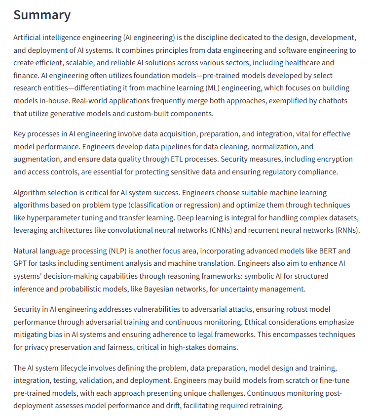

# AI Text Summarizer

A Streamlit application that uses AI to generate clear, concise summaries from pasted text or uploaded documents.

Users can paste text directly or upload TXT, PDF, and Word documents, choose their preferred summary length, and generate an AI-powered summary that can be downloaded as a text file.

## Live Demo

Try the deployed application here:

[Open AI Text Summarizer](https://text-summarizer-smylmtcxkokonvbfynncin.streamlit.app)

## Features

- Paste text directly into the application
- Upload TXT, PDF, and Word (.docx) documents
- Extract text automatically from uploaded documents
- Generate AI-powered summaries using OpenAI
- Choose between short, medium, and detailed summaries
- Preserve important information and technical formulas
- Download generated summaries as TXT files
- Handles empty, unreadable, and corrupted documents
- Limits excessively large inputs for reliable processing

## Screenshots

### Paste Text


### Upload a Document


### Generated Summary



## Technologies Used

- **Python** – Core application logic and document processing
- **Streamlit** – Web application interface and session state management
- **OpenAI API** – AI-powered text summarization
- **PyPDF2** – Text extraction from PDF documents
- **python-docx** – Text extraction from Microsoft Word documents
- **GitHub** – Source code and version control
- **Streamlit Community Cloud** – Application deployment

## How It Works

1. Choose between pasting text or uploading a document.
2. If a document is uploaded, the application extracts its text from TXT, PDF, or DOCX files.
3. Select the desired summary length: Short, Medium, or Detailed.
4. The application validates the input and sends the extracted text to the OpenAI API.
5. The generated summary is displayed in the application and can be downloaded as a TXT file.

The live demo includes a per-session usage limit to help control API usage.

## Running Locally

To run the application on your own computer:

### 1. Clone the repository

```bash
git clone text-summarizer-smylmtcxkokonvbfynncin
cd Text-Summarizer
```

### 2. Install the required packages

```bash
pip install -r requirements.txt
```

### 3. Configure your OpenAI API key

Create a folder named `.streamlit` in the project directory.

Inside the `.streamlit` folder, create a file named:

```text
secrets.toml
```

Add your OpenAI API key to `secrets.toml`:

```toml
OPENAI_API_KEY = "your-api-key"
```

The `secrets.toml` file is excluded from Git through `.gitignore` to prevent the API key from being committed to the repository.

### 4. Run the application

```bash
streamlit run app.py
```
## Project Structure

```text
text-summarizer/
├── screenshots/
│   ├── Pasted-Text-Input.png
│   ├── Upload-Document.png
│   └── Summary.png
├── .gitignore
├── app.py
├── README.md
└── requirements.txt
